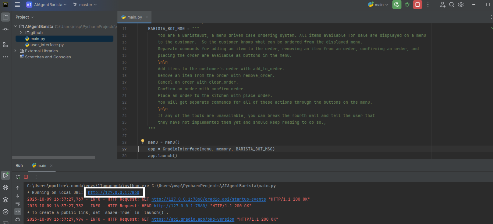
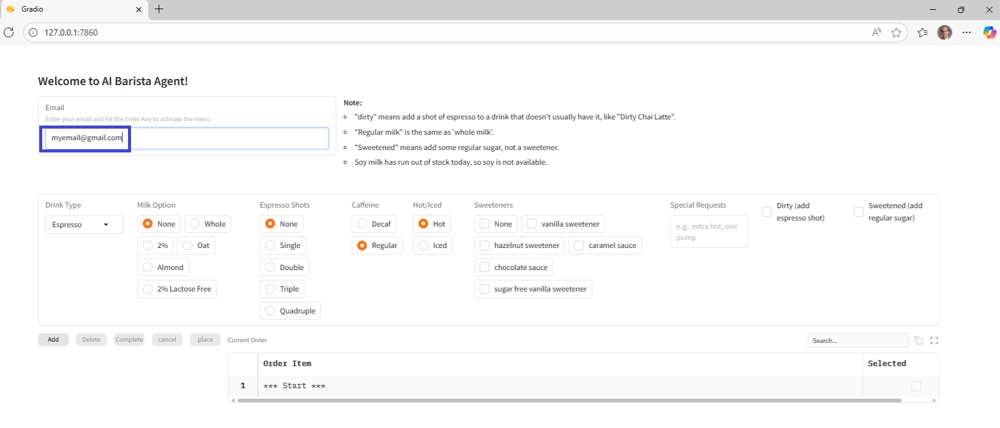
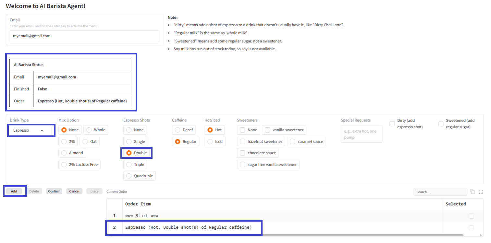
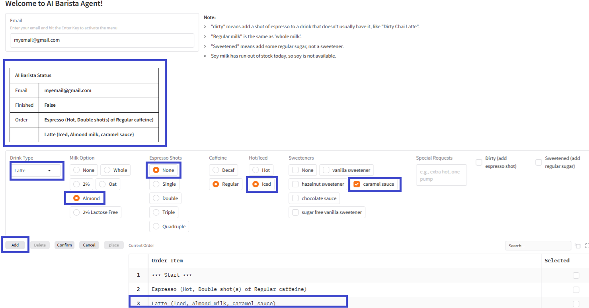
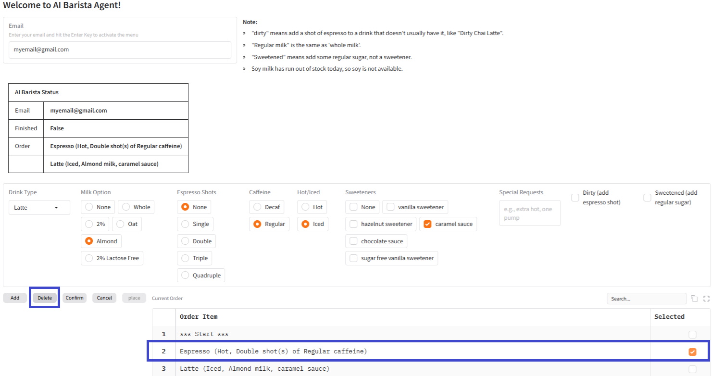
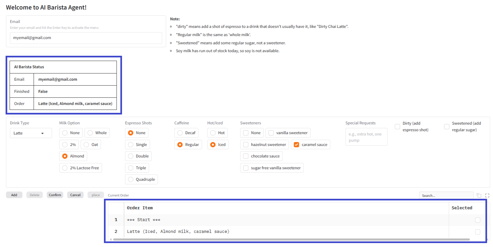
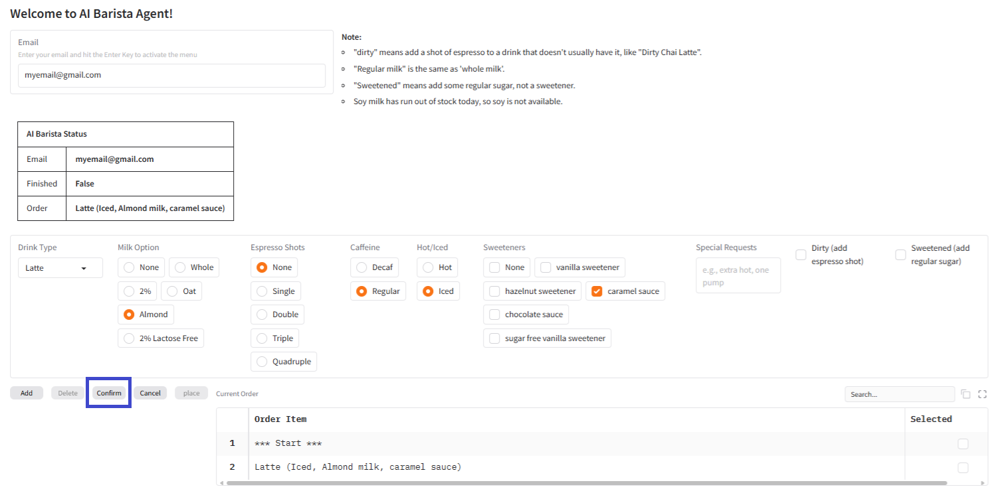
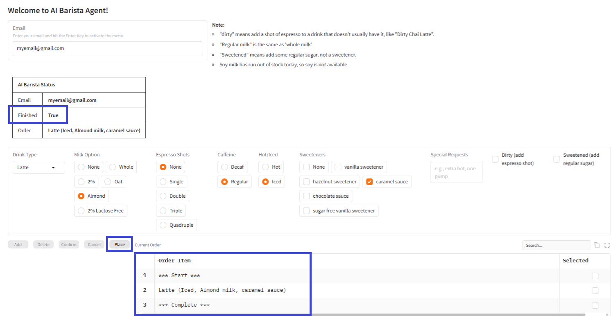
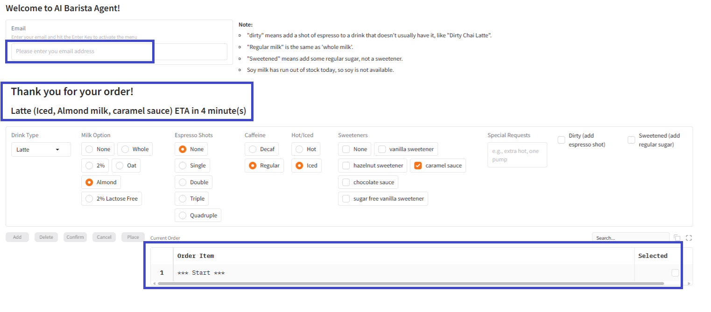

# AIAgentBarista

This agent was adapted from From day 3 assignment of the 5-Day Gen AI Intensive Course with Google, Generative Agents - Build an agentic ordering system in LangGraph.

# Purpose

To add an interactive UI to control an AI Based Barista.  Custom tools to add to the order, remove from the order, cancel the order, confirm the order and place the order are available to the agent.

# Features

Gradio UI component to control the agent  
Langchain  
Uses gemini-2.0-flash LLM from Google  

# Installation

Create PYCharm AIAgentBarista project locally in a chosen virtual environment  
Add dependencies to virtual environment as described in requirements.txt  
Add in src files main.py, user_interface.py  
Modify user_interface.py to update your GOOGLE API key.  

# Usage

Run main.py from PYCharm project  
  
System will create a local URL "* Running on local URL:  http://127.0.0.1:7860"  
Click on link to instance the Gradio UI in your default browser  
Enter a valid email address and hit enter to activate the buttons in the UI  
  
Select Espresso Drink with two shots and click add button to add to your order  
  
Select Latte Drink, almond milk, no shots, caramel sweetener, iced and click add button to add to your order  
  
Select Espresso drink from the grid, delete button becomes active, and click delete to remove the espresso from the order  
  
Espresso removed from order  
  
Click confirm button to confirm the order  
  
Order is now locked awaiting place to send to the kitchen  
  
Click place to send to the kitchen, Barista displays ETA message, email is reset awaiting new order  
  

